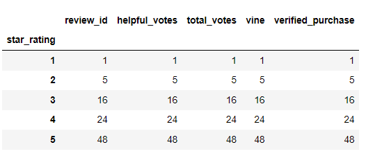
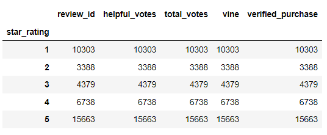
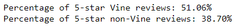

# Amazon_Vine_Analysis

## Overview
We are running an analysis of Amazon Vine Program using Amazon RDS to analyze this big data. The process of ETL is taken in the following steps.
1. Use Spark to extract the data from amazon's data storage.
2. Transform the data to form 4 dataframes: reviews, products, customers, and vine.
3. Load the data locally using postgres
4. Use python pandas library for further analysis.

## Results
From the large dataset, I was able to narrow down the focus into customer reviews. The data is saved into Resources under 'vine_tables.csv'

### How many Vine reviews and non-Vine reviews were there?
- There were 94 Vine reviews altogether and 40471 non-Vine reviews. This ratio turns out to be 0.23% of reviews are Vine reviews.

### How many Vine reviews were 5 stars? How many non-Vine reviews were 5 stars?

- There are 48 5-star reviews from the Vine program.

- There were 15663 5-star review from the non-Vine.

### What percentage of Vine reviews were 5 stars? What percentage of non-vine reviews were 5 stars?

- According to the data, 51.06% of the Vine reviews came out to be 5-stars while 38.70% of the non-Vine reviews came out to be 5-stars.

## Summary
From observing the results, we can see that there is in fact a positive bias for reviews from the Vine Program. 